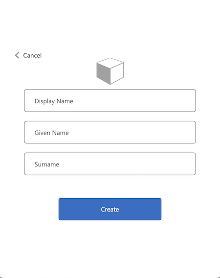

# Partner API
# API Portal
API Portal allows the partner to create an account for using the API in the sandbox environment.
In the API portal sandbox you can see the Product you have access, in this case, `Partner API`, 
In the API portal you can also access the subscription associate to your account.
Below we will depict how to use the portal.

## Landing Page And Menu
Below we can see the Portal landing page, the landing page provide you with access to the Menu
as well to the partner API documentation.
1. Home page menu.
2. In this menu you can explore the APIs that you have access, in this case, Partner API, only available after sign in.
3. In This menu you can see the products you have access, in this case, Partner API, only available after sign in. 
4. In this menu you can sign in the portal.
5. This is the link for the API documentation page.

## Sign Up
If you are using the portal for the first time you need to Sign Up to be able to use all the features.
For signing up use an account that will be related to the system you want to integrate with partner API, avoid using personal account.

1. Click in the menu Sign In.
2. Click in the button `Azure Active Directory B2C`.

3. Click in `Sign up now` as shown in the bottom of the image.

4. Fill out the email.
5. Click in `Send verification code` and a text box will open, text there the confirmation code you got in your email.
6. Fill out the password.
7. Fill out the password confirmation.
8. Fill out the given name, for making it easier for identify the company, please add here the name of the company.
9. Fill out the person or team responsible for the onboarding(Not mandatory).
10. Click in create and the account will be created

That is the first step of the onboarding process, after that the Partner API Tech Team will handle the subscription and the credentials and send it to you.

## Exploring APIs and Profile
Once you are signed in on the API portal, you can explore the APIs and Products associate to your account, as well
access you subscription key.

1. Click in one of the buttons to access the API page.

2. Partner API will be listed(In case not please contact [the tech team](Contacts.md)), click in `partner-api`.

3. Not you can see the operations available.
4. You can choose a visualization for the definition as well download the OpenAPI definition file.
5. You can see the schema of the API, request, response, etc...

As mentioned before you also can see the subscription key associate to your account.
1. Click in `Profile` menu.
2. And you can display or regenerate your Subscription Key.

## Testing the APIs

Azure portal allow you also to try out the operations directly from the portal,

For trying out API call you can go to the APIs page(as already depicted in the previous section).

For calling all the endpoints in Partner API we need first get the OAuth2 token, for sending in the `Authorization` header.
The process for getting the token is depicted below:

1. Inside partner APi select on the left side, `token` operation.
2. Click in`Try it` on the right side of the screen.

3. A panel on the right side will open up.
4. Considering that you have already been onboarded on the API, your subscription will automatically appear on the
dropbox.
5. Make sure you have the same headers as displayed on the picture `Content-Type` and`Subscription-key`.
6. Add in the `Raw` body input box the `client_id` and `client_secret` in the following format:
   `client_id={client_id}&client_secret={client_secret}`

7. Scrolling down in the panel you will see a dropbox where you can select a client request, you will be able to see the request in the selected client.
Curl, or Java, Python, etc.
8. Click in the button `send` and it will send the request.

8.1 All the operations in Partner API requires mTLS, meaning that you need to provide the certificate for calling any operation.
This is the same certificate that you would have uploaded for your APIM service and added to the trusted list in the certificate store of your workstation.
You can see for instance how to add it on Google Chrome [here](https://support.google.com/chrome/a/answer/6342302?hl=en).
It varies from OS to OS, e.g for Macbook you can find how to add it [here](https://support.apple.com/en-gb/guide/keychain-access/kyca2431/mac).

Once you have added it to the certificate store of your workstation, you can add it to the request in the portal.
When you click on `send` the portal will display a popup requesting you to select a certificate for sending using it in the endpoint call, if you do not select it or select a wrong one, the request will fail due missing certificate,
see more in mTLS section of the [security page](Security.md).

Tip: In case you missed the popup for selecting the certificate, or select the wrong certificate, you can always open the portal again in incognito tab and the \
popup will appear again.

8.2 click `Ok` button after selecting your certificate.

9. Now you can copy the `token` obtained here and use it request.

10. Now you can call the API endpoints with the `Authorization` header.
For example the `ping` endpoint.
11. Do not forget to add the header on the panel on the left side as shown in the below picture.

