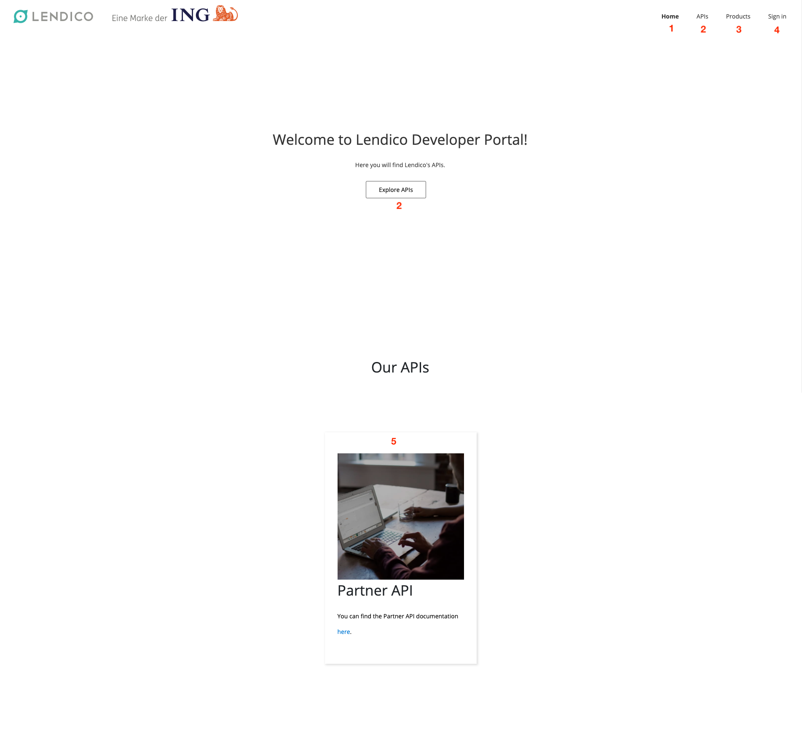
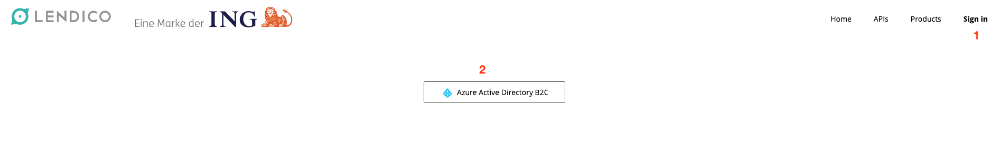
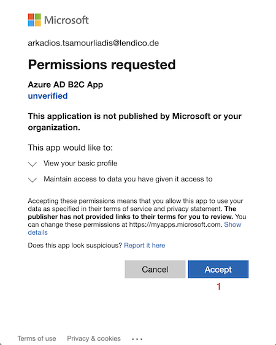
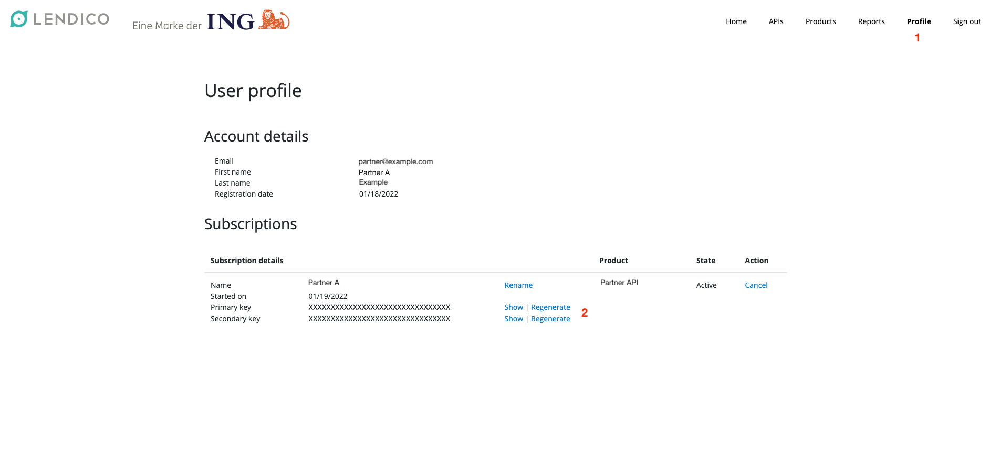

# Partner API
# API Portal
API Portal allows the partner to create an account for using the API in the sandbox environment.
In the API portal sandbox you can see the Product you have access, in this case, `Partner API`, 
In the API portal you can also access the subscription associate to your account.
Below we will depict how to use the portal.

## Landing Page And Menu
Below we can see the Portal landing page, the landing page provide you with access to the Menu
as well to the partner API documentation.
1. Home page menu.
2. In this menu you can explore the APIs that you have access, in this case, Partner API, only available after sign in.
3. In This menu you can see the products you have access, in this case, Partner API, only available after sign in. 
4. In this menu you can sign in the portal.
5. This is the link for the API documentation page.

## Sign Up
If you are using the portal for the first time you need to Sign Up to be able to use all the features.
For signing up use an account that will be related to the system you want to integrate with partner API, avoid using personal account.

1. Click on the menu Sign In.
2. Click on the button `Azure Active Directory B2C`.

3. In the pop-up window (make sure your browser allows pop-ups), sign-in with your Microsoft account. The creation of a Microsoft account is outside the scope if this guide. 

4. After signing-in with your Microsoft account, authorise Azure AD B2C App by clicking on `Accept`

5. Fill in `Display Name` you company name.

That is the first step of the onboarding process, after that the Partner API Tech Team will associate the Partner API to your newly created account in API Portal.

## Exploring APIs and Profile
Once you are signed in on the API portal, you can explore the APIs and Products associate to your account, as well
access you subscription key.

1  Click on one of the buttons to access the API page.

2 Partner API will be listed(In case not please contact [the tech team](Contacts.md)), Click on `partner-api`.

3 Now you can see the API endpoints available.
4 You can choose a visualization for the definition as well download the OpenAPI definition file.
5 You can see the schema of the API, request, response, etc...

As mentioned before you also can see the subscription key associated to your account.
1 Click on `Profile` menu.
2 And you can display or regenerate your Subscription Key.

