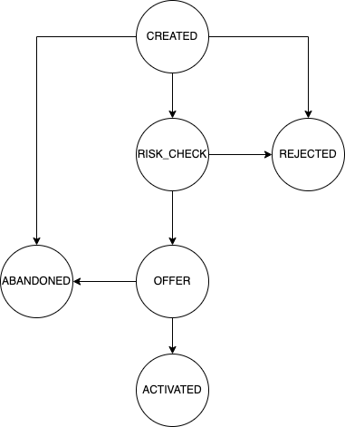

# Partner API

# Statuses

## Loan Application Statuses

### Loan Application Status Transition Diagram

The below diagram represents the possible status for the application life cycle. You can see the description for each
status

###  Application Statuses

For the description of each status you can check out [this page](Enums.md#-application-statuses).
