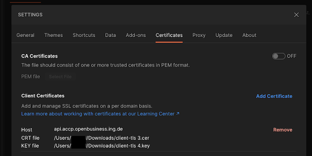

# Partner API
# Samples and Tutorials
The code snippet provided on this page are only for exemplification purpose, as tutorial, it makes sense to keep it simple for easy understanding 
and making easy to display code snippet, so code quality, security, libraries, etc. should not be taken for granted.

## Java Apache HttpClient full implementation of a client
Below you find am example of a complete client for partner API, adding certificate for client side, using OAuth2 authorization, and subscription key in the header

```
import com.fasterxml.jackson.annotation.*;
import com.fasterxml.jackson.databind.ObjectMapper;
import lombok.Data;
import org.apache.http.ssl.SSLContexts;
import javax.net.ssl.SSLContext;
import java.io.*;
import java.net.*;
import java.net.http.*;
import java.nio.charset.StandardCharsets;
import java.security.*;
import java.security.cert.CertificateException;
import java.time.*;
import java.time.format.DateTimeFormatter;
import java.util.*;
import java.util.stream.Collectors;

public class PartnerAPIClient {

    private static final String KEYSTORE_PASSWORD = "password"; //"change to your keystore password";
    private static final String KEYSTORE_PATH = "/message-signing.jks";// "changed to your keystore path(with both, message signing and tls certificate), file e.g keystore.jks";
    private static final String PKEY_ALIAS = "changed to your private key alias in the keystore";//
    private static final String CLIENT_ID = "change for you client id (provided by us)";
    private static final String CLIENT_SECRET = "change for you client secret (provided by us)";
    private static final String PARTNER_API_BASE_URL = "https://api.accp.openbusiness.ing.de/partner-api";
    private static final String TOKEN_URL = "https://api.accp.openbusiness.ing.de/token-api/oauth2/token";
    private static final String SUBSCRIPTION_KEY = "change to your subscription key (from API Portal)";
    private static final String PARTNER_COMPANY_ID = "change to your unique Partner UUID";
    private static final DateTimeFormatter HEADER_DATE_FORMAT = DateTimeFormatter.ofPattern("EEE, dd MMM yyyy HH:mm:ss z");
    private static KeyStore keyStore;

    public static void main(String[] args) throws IOException, GeneralSecurityException, InterruptedException {
        keyStore = KeyStore.getInstance("JKS");
            try (InputStream keyStoreStream = Thread.currentThread().getContextClassLoader().getResourceAsStream(KEYSTORE_PATH)) {
                if (keyStoreStream == null) {
                    throw new FileNotFoundException("Keystore file not found in path: " + KEYSTORE_PATH);
                }
                keyStore.load(keyStoreStream, KEYSTORE_PASSWORD.toCharArray());
            }
        pingRequest();
    }

    private static void pingRequest() throws GeneralSecurityException, IOException, InterruptedException {
        var body = "";
        var currentDate = getCurrentGMTDateAsString(HEADER_DATE_FORMAT);
        var digest = calculateDigest(body);
        var messageToSign = buildMessage(digest, currentDate, "/ping", "get");
        var signedMessage = calculateSignature(messageToSign);
        var signatureHeader = buildSignatureHeader(signedMessage, CLIENT_ID);
        var partnerPingRequest = HttpRequest.newBuilder()
                .uri(URI.create(PARTNER_API_BASE_URL + "/ping"))
                .header("Authorization", "Bearer " + getToken())// OAuth2 authentication
                .header("Subscription-Key", SUBSCRIPTION_KEY)// Add Subscription-Key header
                .header("Partner-Company-Id", PARTNER_COMPANY_ID)// Add Partner-Company-Id header
                .header("Date", currentDate)// Add date header
                .header("Digest", digest)// Add digest header
                .header("Signature", signatureHeader) // add signature header
                .GET()
                .build();

        var httpClient = HttpClient.newBuilder()
                //.proxy(ProxySelector.of(new InetSocketAddress("127.0.0.1", 3128))) Add proxy for whitelisted IP, if needed
                .sslContext(getSSLContext())
                .build();
        var response = httpClient.send(partnerPingRequest, HttpResponse.BodyHandlers.ofString());
        System.out.println(response.body());
    }

    private static SSLContext getSSLContext() throws UnrecoverableKeyException, CertificateException, NoSuchAlgorithmException, KeyStoreException, IOException, KeyManagementException {
        return SSLContexts.custom().loadKeyMaterial(keyStore, KEYSTORE_PASSWORD.toCharArray()).build();
    }

    private static String getToken() throws IOException, InterruptedException, UnrecoverableKeyException, CertificateException, NoSuchAlgorithmException, KeyStoreException, KeyManagementException {
        Map<String, String> parameters = new HashMap<>();
        parameters.put("client_id", CLIENT_ID);
        parameters.put("client_secret", CLIENT_SECRET);
        var body = parameters.keySet().stream()
                .map(key -> key + "=" + URLEncoder.encode(parameters.get(key), StandardCharsets.UTF_8))
                .collect(Collectors.joining("&"));
        var httpClient = HttpClient.newBuilder()
                //.proxy(ProxySelector.of(new InetSocketAddress("127.0.0.1", 3128))) Add proxy for whitelisted IP, if needed
                .sslContext(getSSLContext())
                .build();

        var request = HttpRequest.newBuilder().uri(URI.create(TOKEN_URL))
                .header("Content-Type", "application/x-www-form-urlencoded")
                .header("Subscription-Key", SUBSCRIPTION_KEY)// Add Subscription-Key header
                .POST(HttpRequest.BodyPublishers.ofString(body)).build();

        var response = httpClient.send(request, HttpResponse.BodyHandlers.ofString());
        var token = new ObjectMapper().readValue(response.body(), Token.class);
        return token.getAccessToken();
    }

    private static String calculateSignature(String messageToSign) {
        try {
            var dsa = Signature.getInstance("SHA256withRSA");
            dsa.initSign(getMessageSigningPrivateKey());
            dsa.update(messageToSign.getBytes(StandardCharsets.UTF_8));
            return base64Encode(dsa.sign());
        } catch (Exception e) {
            return "";
        }
    }

    private static String buildMessage(String digest, String date, String uri, String httpMethod) {
        try {
            return new StringBuilder()
                    .append("(request-target): ").append(httpMethod.toLowerCase()).append(" ").append(uri)
                    .append("\ndate: ").append(date)
                    .append("\ndigest: ").append(digest)
                    .toString();
        } catch (Exception e) {
            return "";
        }
    }

    private static String base64Encode(byte[] value) {
        return Base64.getEncoder().encodeToString(value);
    }

    private static String calculateDigest(String payload) {
        try {
            MessageDigest messageDigest = MessageDigest.getInstance("SHA-256");
            byte[] digest = messageDigest.digest(payload.getBytes(StandardCharsets.UTF_8));
            return "SHA-256=" + base64Encode(digest);
        } catch (Exception e) {
            return "";
        }
    }

    private static String buildSignatureHeader(String signedMessage, String clientId) {
        return new StringBuilder()
                .append("keyId=\"").append(clientId).append("\"")
                .append(",algorithm=\"rsa-sha256\"")
                .append(",headers=\"(request-target) date digest\",signature=\"")
                .append(signedMessage).append("\"")
                .toString();
    }

    private static String getCurrentGMTDateAsString(DateTimeFormatter formatter) {
        ZonedDateTime gmtDateTime = ZonedDateTime.now().withZoneSameInstant(ZoneOffset.UTC);
        return gmtDateTime.format(formatter);
    }

    private static PrivateKey getMessageSigningPrivateKey() throws UnrecoverableKeyException, KeyStoreException, NoSuchAlgorithmException {
        return (PrivateKey) keyStore.getKey(PKEY_ALIAS, KEYSTORE_PASSWORD.toCharArray());
    }
}

@Data
@JsonIgnoreProperties(ignoreUnknown = true)
class Token {
    @JsonProperty("token_type")
    private String tokenType;

    @JsonProperty("expires_in")
    private long expiresIn;

    @JsonProperty("ext_expires_in")
    private long extExpiresIn;

    @JsonProperty("access_token")
    private String accessToken;
}
   
```

## Postman collection
You can find an example postman collection here: [Postman collection](resource/ING-Lending-Partner-API.postman_collection.json)

How to use it:
1. Run once the 1st GET (install pmlib). This will install the `pmlib` from [https://joolfe.github.io/postman-util-lib/](https://joolfe.github.io/postman-util-lib/) as a variable in Global Environment.
   It's needed to cryptographically sign the requests.
2. Set the following collection variables:
   * private_key - for filling the variable you can open the private key(any text editor) of your message signing certificate and copy and paste the content.
   * apim_client_id - your client id (will be provided by ING).
   * apim_client_secret - your client secret (will be provided by ING).
   * subscription_key - your subscription key (can be found in API Portal).
   * partner_company_id - your unique partner id (was provided by ING on first onboarding).
   * apim_token - will be set when calling the "token-api get token [APIM]" endpoint
3. Add the generated client TLS certificate and key to your Postman Settings for the Partner API Host 


## Generating Self-Signed certificate with openssl


1 Generate a new RSA private key. 
The password of the private key can be entered during execution of the command(due arg stdin), avoiding it to be listed in the shell history.

```
openssl genrsa -out server.key -passout stdin 2048
```

2 Generate the X.509 Certificate Signing Request

```
openssl req -sha256 -new -key server.key -out server.csr
```

3 Sign the X.509 certificate with your own private key

```
openssl x509 -req -sha256 -days 365 -in server.csr -signkey server.key -out server_public.crt
```

4 Pack the key and the crt file into a pfx file to send to us.

```
openssl pkcs12 -export -nokeys -in server_public.crt -out server.pfx
```

NOTE: In the step 4 you will be asked for a password for packing the file into PFX file, in case you use a password here you will need to send us the password.

## In case you are using a java client (as in the tutorial example), you can generate a pkcs12 file for the key store as below

```
openssl pkcs12 -export -in server_public.crt -inkey server.key -out server-cert.p12
```

### Generating pfx file from key and certificate
For generating pfx file from key and certificate you can follow the following steps using `openssl`

```
openssl pkcs12 -export -nokeys -in domain.name.crt -out domain.name.pfx
```

If you have a root CA and intermediate certs, then include them as well using multiple -in params

```
openssl pkcs12 -export -out domain.name.pfx -inkey domain.name.key -in domain.name.crt -in intermediate.crt -in rootca.crt
```

Example:

```
openssl pkcs12 -export -nokeys -in server_public.crt -out server.pfx
```
